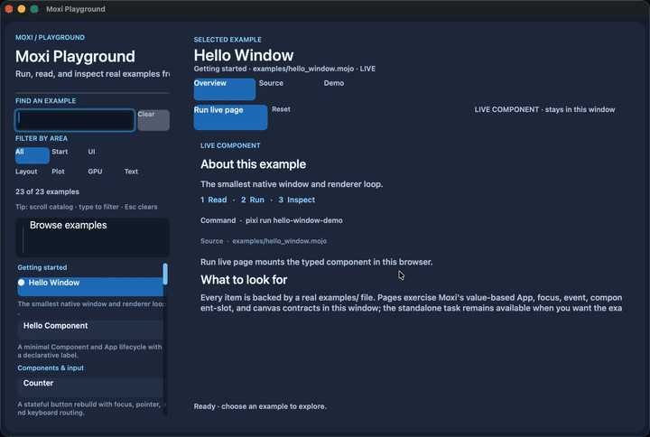

# Moxi

Moxi (pronounced "mox-ee") is an experimental native UI library for Mojo based on Rust's [Xilem](https://xilem.dev/) by Raph Levien. The
name is a portmanteau of Mojo+Xilem and also plays off the meanings of "mojo" / "moxie." It's also a nod to the `xi` lineage behind
Xilem. Notably, Xilem is based on SwiftUI, another major Chris Lattner project.

Moxi is broader than a UI toolkit: the surface also includes a full plotting
library, an in-process capability bus for agent-safe mutation authorization,
and host bridges for iOS, Android, and the Web, alongside the core view and
render pipeline. macOS on Apple Silicon (`osx-arm64`) is the only supported
demo target today.

Three ideas anchor the design:

1. **Identity-based reconciliation.** Declarative view trees are reconciled
   onto retained runtime state by stable id, reusing nodes across rebuilds
   instead of rebuilding a widget tree from scratch.
2. **Backend-neutral paint streams.** Views produce an ordered,
   backend-neutral `PaintCommand`/`Scene` stream; native AppKit, a batched
   Metal path, and a deterministic software renderer all consume the same
   contract.
3. **Headless-first testing.** Deterministic headless renderers, golden-image
   corpora, and shared conformance fixtures make behavior testable without a
   display — a first-class design constraint, not an afterthought.

## Highlights

The full per-feature inventory, including fallback behavior and scope
caveats, is in [docs/features.md](docs/features.md).

- Declarative `ColumnView`/`ViewNode` layout with vertical/horizontal/stack/grid/split/portal containers and virtualized scrolling.
- Identity-based reconciliation with observable create/reuse/update/remove/move counters.
- A typed `Component`/`App` lifecycle with subtree and keyed-subtree execution for localized updates.
- Backend-neutral events, focus, and keyboard navigation, including native macOS IME composition.
- Semantic spacing/typography/color tokens with theme presets and reusable recipes.
- Native AppKit rendering, a batched Metal scene renderer, and a deterministic software renderer.
- Backend-neutral accessibility semantics mapped to a native macOS `NSAccessibilityElement` tree.
- A first-class Plot library with statistical recipes, facets, linked selection, and SVG export.
- Shared iOS, Android, and Web host bridges with deterministic fallbacks (not yet Mojo package targets).
- A deterministic in-process capability bus for agent-safe mutation authorization.
- A searchable Moxi Playground demo browser covering every checked-in example.
- Deterministic headless testing: golden-image corpora, text conformance fixtures, and CI-checked visual diffs.

## Example

Components own state and produce lightweight views; `App` owns the current
view and retained runtime:

```mojo
from moxi import App, CounterState, Event, Rect

var app = App[CounterState](
    CounterState(),
    Rect(0.0, 0.0, 384.0, 184.0),
)

# After the window backend produces an Event:
if app.dispatch(event):
    app.render(renderer)

# The same root can be rebuilt after a window resize:
if app.resize(Rect(0.0, 0.0, width, height)):
    app.render(renderer)
```

`Component.build(bounds)` receives the current root rectangle; `update()` and
`resize()` return whether `App` rebuilt its view and retained runtime.
`ComponentSlot[Child]` lets a parent own a typed child under a namespaced
container with local event routing, and `TypedSubtreeExecutor`/
`KeyedSubtreeExecutor` let a component-owned surface update without
rebuilding its parent. See [docs/features.md](docs/features.md) for the
full runtime and reconciliation contract.

## Quick start

Install [Pixi](https://pixi.sh), then run:

```sh
pixi run mojo --version
pixi run build
pixi run test
pixi run demo
pixi run counter-demo
pixi run plot-demo
pixi run capability-bus-demo
pixi run interactive-fractal-demo
```

`pixi run demo` opens the Moxi Playground: search or filter the catalog, read
an example's overview/source, and mount its real component page in the same
window. `pixi run counter-demo` opens the interactive counter from the example
above; `pixi run plot-demo` renders the plotting library through the software
scene backend; `pixi run capability-bus-demo` opens a ten-step walkthrough
whose controls all go through a typed `CapabilityBus` handler; and
`pixi run interactive-fractal-demo` is a Metal-accelerated port of Xilem's
paint example. For the complete demo, benchmark, and packaging task list, see
[docs/demo-browser.md](docs/demo-browser.md) and
[docs/features.md](docs/features.md#demos).

To build the distributable Pixi packages, run `pixi publish --target-dir
output/moxi` followed by `pixi publish --path packages/moxi_plot/pixi.toml
--target-dir output/moxi`; the workspace resolves `osx-arm64` and `linux-64`,
with `pixi run package-consumer` as the install-and-import smoke lane.

[](docs/moxi-capability-bus-walkthrough-10s.mp4)

## Architecture

Views are Mojo value types. A component owns application state, builds a
lightweight declarative view, and handles events; `App` owns the retained
runtime and reconciles the declarative tree into an ordered `PaintCommands`
stream on every update. Native AppKit renders that stream directly, or it can
be translated into the backend-neutral `Scene`/`SceneRenderer` path for the
Metal and software backends.

[ARCHITECTURE.md](ARCHITECTURE.md) documents the implemented contracts and
lifecycle in full. [SPEC.md](SPEC.md) is long-term design material and
includes ideas that are not implemented in this release.

## Attribution

The capability-bus concept is credited to David Ash and was seeded from [The
Mythophor capability-bus article](https://www.mythophor.com/agent-ready-architecture-the-capability-bus-pattern/).
The Moxi implementation adapts that seed into an in-process UI policy
boundary; the full design note is in
[docs/capability-bus-design.md](docs/capability-bus-design.md).

## License

Moxi is available under the [MIT License](LICENSE).
