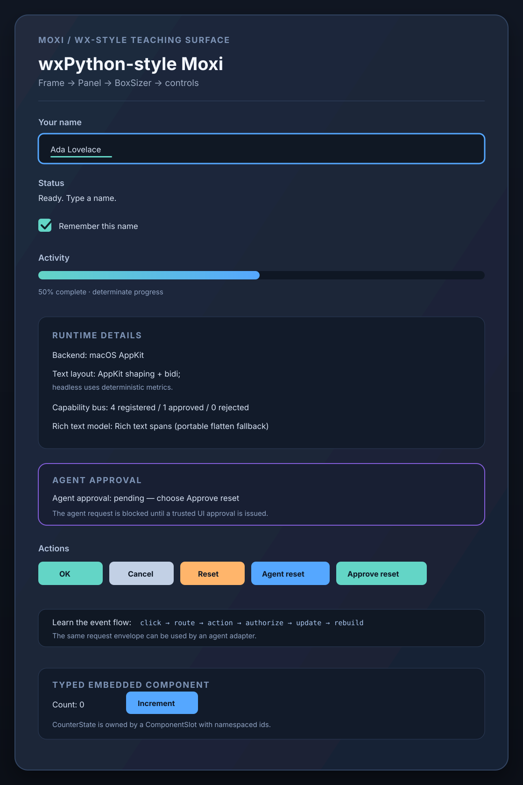
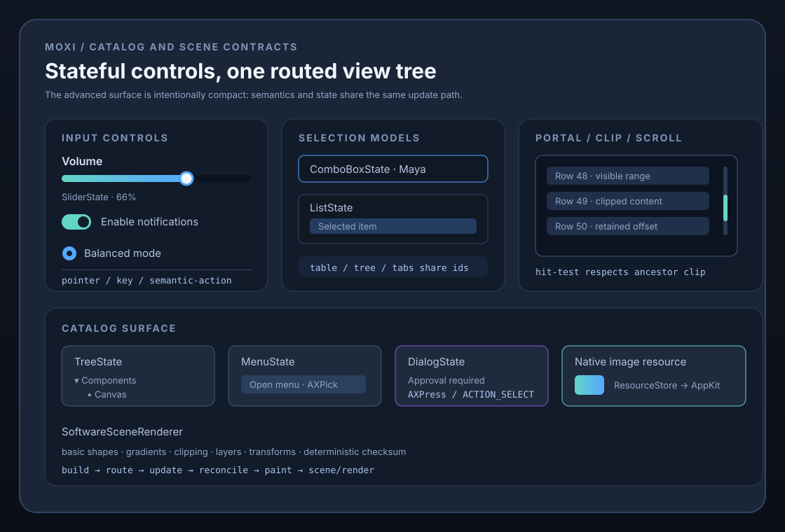

# Moxi visual documentation

The wx-style showcase is the release's visual acceptance surface. It is a
single native AppKit window that deliberately exposes the component tree and
the integration seams instead of hiding them behind a polished application
shell.

Run it with:

```sh
pixi run wx-style-demo
```

The source-controlled [showcase reference](wx-style-showcase.svg) records the
intended composition and labels the behavior that should be visible when the
demo runs. The [advanced reference](wx-style-advanced.svg) records the catalog,
scrolling, native-image, and scene-rendering surface. These references use
representative post-interaction states so the pending approval path,
determinate progress, and stateful controls are visible together:





- Frame → Panel → vertical and horizontal BoxSizer-like containers.
- A text field, checkbox, determinate progress indicator, and routed actions.
- Slider, switch, radio, combo, list, table, tree, menu, dialog, tabs, canvas,
  separator, and image/resource descriptors in the shared catalog surface.
- A clipped portal with persistent scroll state and fixed-extent visible-range
  math.
- A deterministic software scene surface covering basic shapes, gradients,
  clipping, opacity layers, and transforms.
- Backend, text-layout, rich-text, conversation, and capability status.
- The blocked `Agent reset` request followed by the trusted `Approve reset`
  action.
- The typed embedded counter component and the explanatory event-flow copy.

The post-0.5 visual surfaces use the same scene contract:

- `pixi run plot-demo` renders the first plotting library slice through the
  deterministic software scene path.
- `pixi run plot-gallery` exercises the supported declarative plot surface;
  the [gallery reference](plot-gallery.svg) shows its two facet panels,
  layered line/dot marks, categorical color, and size variation.
- `pixi run plot-svg` serializes that plot as browser-compatible SVG, which is
  the current Web-target visual export surface.
- `pixi run metal-window-demo-build` compiles the experimental native Metal
  window; launch the resulting binary on macOS to inspect Retina-aware
  CAMetalLayer presentation.

This SVG is a deterministic design reference, not a fabricated runtime
screenshot. Native screenshots should be captured on macOS after launching the
demo, because AppKit font metrics, window chrome, scale factor, and accessibility
behavior are platform output. The headless counterpart is covered by
`tests/wx_style.mojo`, `tests/wx_advanced.mojo`,
`tests/scene_renderer.mojo`, and `tests/package_consumer.mojo`. The SVGs are
checked as well-formed XML by `pixi run check`.
